# Pocket Ledger

Simple bookkeeping for a self-employed courier (built for a Wolt driver, works for anyone): photograph receipts and
invoices, record expenses and income, and keep everything filed in monthly folders on the phone. Export CSV / PDF
reports for the accountant and full ZIP backups. Cloud sync (a .NET API + SQL Server) is planned as a later phase.

```
Book Keeping App/
├── mobile/        Expo (React Native + TypeScript) app — Android first, iOS from the same code
├── api/           (planned) ASP.NET Core Web API + SQL Server for backup / multi-device sync
└── README.md
```

## Screenshots

<table>
  <tr>
    <td align="center">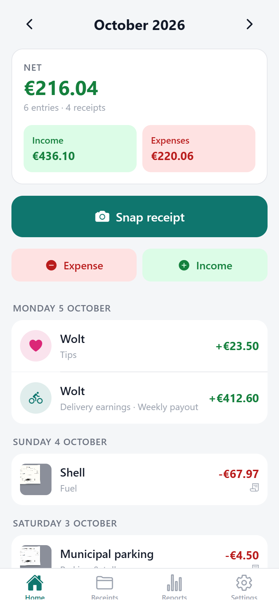<br><sub><b>Home</b> – month overview, one-tap <i>Snap receipt</i>, entries by day</sub></td>
    <td align="center">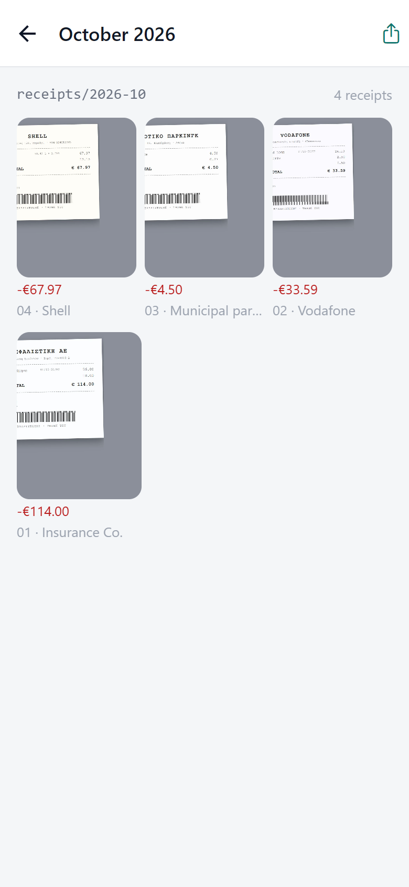<br><sub><b>Monthly receipt folder</b> – photos filed automatically under <code>receipts/2026-10</code></sub></td>
    <td align="center">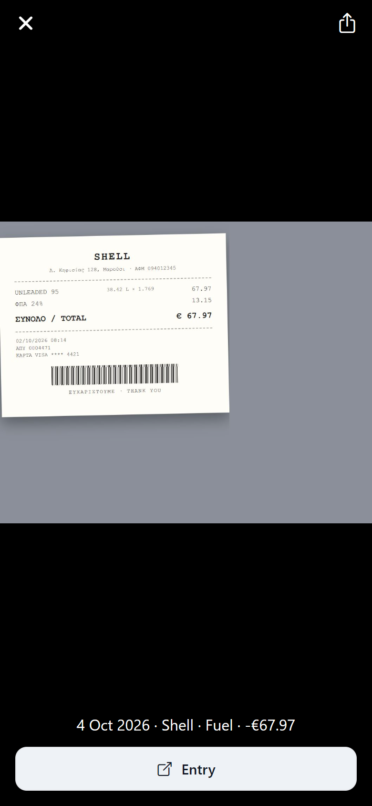<br><sub><b>Receipt viewer</b> – share the photo or jump to its entry</sub></td>
  </tr>
  <tr>
    <td align="center">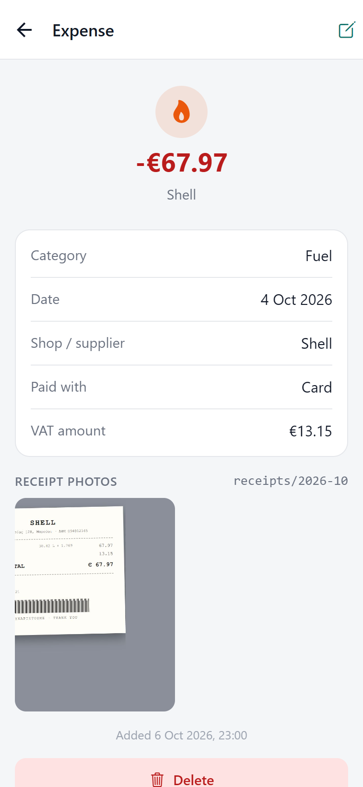<br><sub><b>Entry detail</b> – category, supplier, payment, VAT, photos</sub></td>
    <td align="center">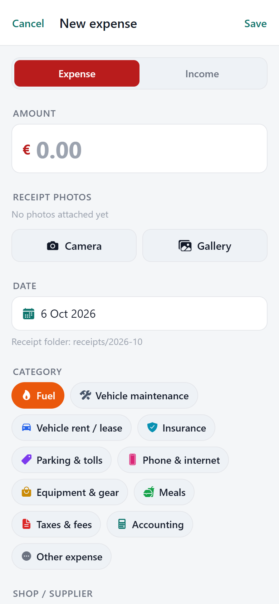<br><sub><b>New expense</b> – amount, camera/gallery, date, categories</sub></td>
    <td align="center">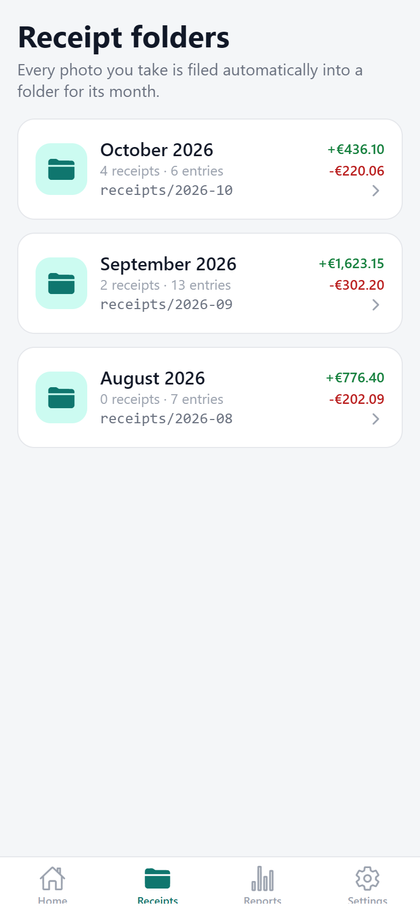<br><sub><b>Receipt folders</b> – one folder per month with totals</sub></td>
  </tr>
  <tr>
    <td align="center">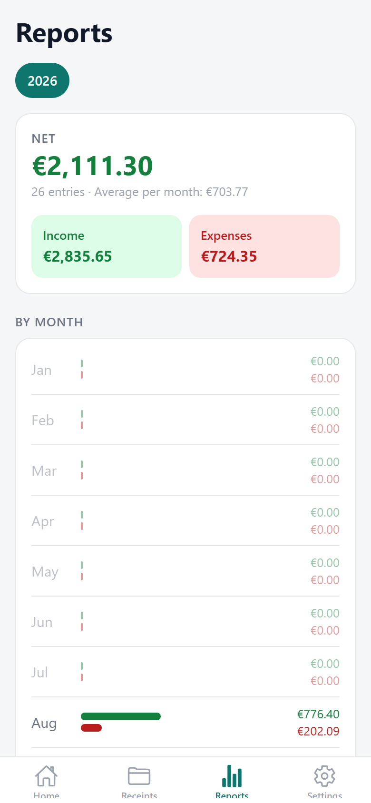<br><sub><b>Reports</b> – year totals and income vs expenses per month</sub></td>
    <td align="center">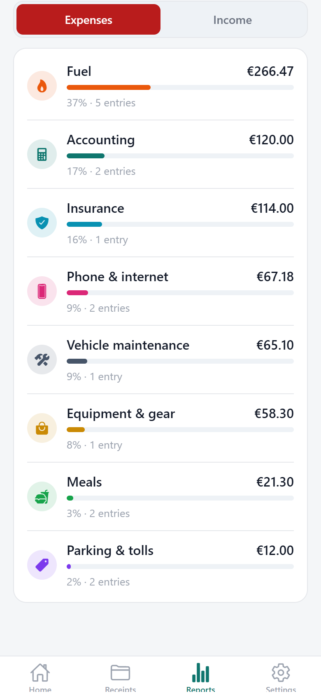<br><sub><b>By category</b> – where the money goes</sub></td>
    <td align="center">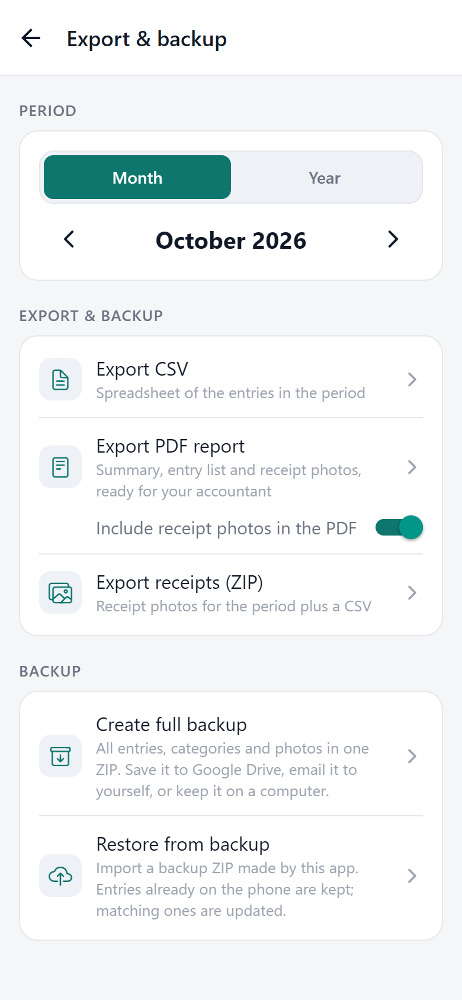<br><sub><b>Export &amp; backup</b> – CSV, PDF report, ZIP, full backup/restore</sub></td>
  </tr>
  <tr>
    <td align="center">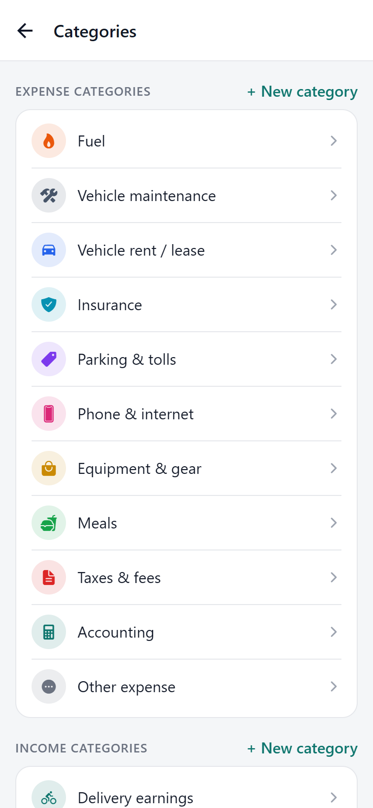<br><sub><b>Categories</b> – courier defaults, add your own</sub></td>
    <td align="center">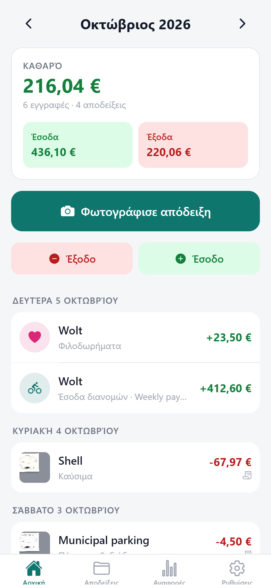<br><sub><b>Greek UI</b> – English and Greek, EUR by default</sub></td>
    <td align="center">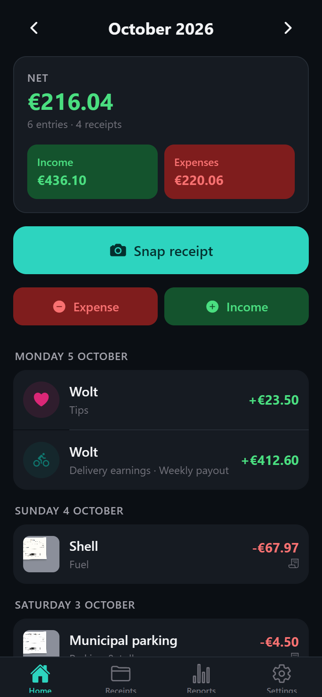<br><sub><b>Dark mode</b> – follows the system setting</sub></td>
  </tr>
</table>

The screenshots are taken from the web build of the same code at phone size (`npm run screenshots`, see
[Screenshots](#regenerating-the-screenshots) below) with the built-in demo data. On a phone the screens are identical;
only the navigation bars are native.

## Stack and why

| Layer      | Choice                                             | Reason                                                                                         |
| ---------- | -------------------------------------------------- | ---------------------------------------------------------------------------------------------- |
| Mobile     | Expo SDK 57, React Native 0.86, TypeScript, Expo Router | React skills carry over; one code base for Android and iOS; Expo Go for instant testing; EAS Build produces APKs/iOS builds in the cloud so no Android Studio/Xcode is needed on Windows. |
| Local data | `expo-sqlite` (SQLite on the phone)                | Relational, fast, works offline, maps 1:1 to SQL Server later.                                 |
| Photos     | `expo-file-system` + `expo-image-manipulator`      | Receipts are compressed JPEGs stored in `receipts/YYYY-MM/` inside the app's private storage.  |
| Backend    | .NET (later)                                       | Matches your skills; the schema already carries ids, timestamps and tombstones for sync.       |

## Features (phase 1 — phone only)

- **Snap receipt**: one tap opens the camera, compresses the photo (max 1600 px, JPEG) and files it automatically in
  the folder for the entry's month, e.g. `receipts/2026-10/`. Change the date and the photo moves to the right folder.
- **Expenses and income** with amount, date, category, counterparty (shop / Wolt), payment method, note, optional
  invoice number and VAT. Several photos per entry. Recent counterparties are suggested.
- **Month view** with income / expenses / net, entries grouped by day.
- **Receipt folders** tab: browse each month's photos as a grid, open the related entry, share a month as ZIP.
- **Reports**: income vs expenses per month for a year, breakdown by category.
- **Categories**: courier-oriented defaults (fuel, vehicle maintenance, insurance, phone, meals, delivery earnings,
  tips…) plus custom ones with icon and color; hide or delete.
- **Export**: CSV (opens in Excel, UTF-8 BOM so Greek text is correct), PDF report with summary, entry table and all
  receipt photos, ZIP of a month's photos + CSV.
- **Backup / restore**: one ZIP with every entry, category and photo; restore merges by id. Keep it in Google Drive.
- **English and Greek** UI, currency selectable (defaults from the phone's locale), light and dark mode.

## Running it

Requirements: **Node 20 or newer** and the **Expo Go** app on the phone (Play Store / App Store).

> This machine had Node 14, which is too old for current Expo. A portable Node 22 was unpacked to
> `%LOCALAPPDATA%\node-portable\node-v22.23.3-win-x64` (no system changes). Either upgrade the global Node
> (`winget install OpenJS.NodeJS.LTS`) or prefix your PowerShell session with
> `$env:Path = "$env:LOCALAPPDATA\node-portable\node-v22.23.3-win-x64;$env:Path"`.

```powershell
cd mobile
npm install
npx expo start
```

Scan the QR code with Expo Go (Android: inside the Expo Go app; iPhone: with the camera). Phone and PC must be on the
same Wi-Fi; if the connection fails use `npx expo start --tunnel`.

Useful commands:

```powershell
npm run typecheck      # tsc --noEmit
npm run lint           # eslint, warnings fail
npm test               # jest unit tests (money parsing, dates, CSV, translations)
npx expo-doctor        # dependency / config sanity check
npm run export:android # Metro bundle of the Android app into mobile/dist
```

### Trying it with sample data

In development builds (Expo Go, `expo start`) the Settings screen has a **Load demo data** row that inserts ~26
sample entries over three months, with receipt photos for some of them. **Delete all data** in Settings clears it.

### Regenerating the screenshots

The app also runs in a browser (`npx expo start --web`), using SQLite's wasm build and IndexedDB for photos. The
screenshots in this README are produced from that build:

```powershell
cd mobile
npm run demo:receipts   # renders the sample receipt images into assets/demo (needs Chrome or Edge installed)
npx expo start --web    # in one terminal
npm run screenshots     # in another: walks through the app at phone size and writes docs/screenshots/*.png
```

## Continuous integration

Every push to `main` runs `.github/workflows/ci.yml` on GitHub Actions: install, type-check, lint, unit tests,
`expo-doctor` and a full Metro bundle of the Android app (uploaded as the `android-bundle` artifact). That is the
cloud "does it build" check; it does not need an Expo account.

`.github/workflows/eas-build.yml` is a manual workflow that produces a real APK with EAS Build. It needs a one-time
setup described at the top of that file (link the project with `npx eas-cli@latest init`, add an `EXPO_TOKEN`
repository secret).

### Free APK from GitHub (no Expo account)

`.github/workflows/android-apk.yml` builds a release APK on GitHub's runners and publishes it as a GitHub Release.
It runs on every push to `main` that changes the app, on a pushed `v*` tag, or by hand from the Actions tab. The newest
APK is always at:

```
https://github.com/Leonidas-Antoniadis/pocket-ledger/releases/latest/download/pocket-ledger.apk
```

Open that link on the phone and install. Every build is signed with the same key and gets a higher version code, so
installing a newer APK updates the app and keeps all data. The key is the public template key: fine for sharing with
family, not for a store release.

### Building an installable Android APK with EAS (no Android Studio needed)

Expo Go is for development. For your brother's phone build a standalone APK in the cloud with EAS (free tier is enough):

```powershell
cd mobile
npx eas-cli@latest login            # create a free account at expo.dev if needed
npx eas-cli@latest build:configure  # creates eas.json
npx eas-cli@latest build -p android --profile preview
```

`eas.json` must mark the profile as APK (`build:configure` can be edited afterwards):

```json
{ "build": { "preview": { "android": { "buildType": "apk" }, "distribution": "internal" } } }
```

When the build finishes, open the link on the phone and install the APK. iOS builds work the same way
(`-p ios`) but need an Apple developer account.

## How data is stored on the phone

```
<app documents>/
├── SQLite/pocket-ledger.db
└── receipts/
    ├── 2026-09/  <uuid>.jpg …
    ├── 2026-10/  <uuid>.jpg …
    └── _inbox/   photos taken while a form is open; cleaned up on start
```

Tables (see `mobile/src/db/database.ts`):

- `categories` — id, name (translation key for built-ins), kind, icon, color, archived flag
- `transactions` — id (UUID), kind, amount in cents, currency, date, month (`YYYY-MM`), category, counterparty, note,
  payment method, VAT cents, invoice number, timestamps, `deleted_at` tombstone, `sync_state`
- `attachments` — id, transaction id, relative path (`receipts/2026-10/<uuid>.jpg`), mime, size
- `settings` — key / value (currency, language, name on reports)

Everything stays on the device. The user is responsible for backups until cloud sync ships.

## Code map (`mobile/src`)

| Folder        | Contents                                                                                  |
| ------------- | ----------------------------------------------------------------------------------------- |
| `app/`        | Expo Router screens: `(tabs)/` home, receipts, reports, settings; `transaction/`, `folder/`, `attachment/`, `categories`, `export` |
| `components/` | UI kit (`ui.tsx`), entry form, transaction row, photo strip, month switcher, summary card |
| `data/`       | SQL repositories (categories, transactions, attachments, settings) + change notifications |
| `db/`         | Schema, migrations (`PRAGMA user_version`), default categories                            |
| `services/`   | Receipt file storage, entry save/delete orchestration, CSV/PDF/ZIP export, backup/restore |
| `state/`      | Settings provider (currency, language, profile name) and translated strings hook          |
| `i18n/`       | English and Greek strings                                                                 |
| `utils/`      | Money parsing/formatting (accepts `12,50` and `12.50`), dates, CSV                        |

## Phase 2 — cloud / SQL Server (planned)

The data model is already shaped for it:

- Every row has a client-generated id, `created_at`, `updated_at` and a `deleted_at` tombstone, so the server can
  merge changes from several phones (last-write-wins on `updated_at`) and never needs to re-number anything.
- `transactions.sync_state` (`local` → `dirty` → `synced`) marks what still has to be pushed.
- Photos are referenced by relative path, so they can be uploaded to blob storage with the same key.

Plan: an ASP.NET Core minimal API in `api/` (EF Core + SQL Server) with endpoints such as
`POST /sync/push`, `GET /sync/pull?since=`, `PUT /attachments/{id}` and a small account model, plus a `SyncService`
in the app that runs on demand and on a timer. The local SQLite stays the source of truth on the phone; the server is
backup + multi-device.

## Ideas for later

- OCR of the amount/date from the receipt photo (needs a development build with ML Kit).
- Mileage log (per-km allowance) and recurring expenses (insurance, phone plan).
- Lock the app with biometrics.
- Tax summaries per quarter.
